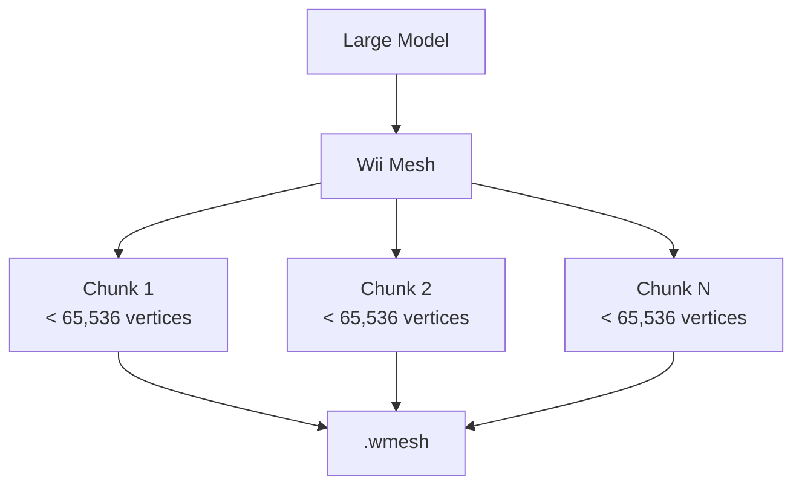

# Wii Mesh

A mesh conversion and asset pipeline tool for the Wii 3D Engine.

Wii Mesh is a desktop application that converts common 3D model formats into a custom binary mesh format designed specifically for the Nintendo Wii. Using Assimp, the tool can import models created in popular software such as Blender, Maya, and 3ds Max, then process and export them into a format that can be loaded efficiently by the engine.

The primary goal of Wii Mesh is to move expensive asset processing tasks from the Wii onto the development PC. Instead of parsing large and complex model formats at runtime, assets are converted ahead of time into a compact representation optimized for fast loading and low memory usage.

### Features

* Imports a wide range of 3D model formats through Assimp
* Converts models into the engine's custom `.wmesh` format
* Reduces runtime processing requirements on Wii hardware
* Produces compact binary assets optimized for loading speed
* Integrates directly with the Wii 3D Engine asset pipeline
* Built in C++ with Visual Studio

### Why a Custom Format?

Modern model formats are designed for flexibility and compatibility rather than performance on constrained hardware. Parsing formats such as FBX, OBJ, or DAE on the Wii would introduce unnecessary loading times and memory overhead.

The `.wmesh` format stores only the information required by the engine, allowing assets to be loaded quickly and predictably on real hardware. This keeps the runtime simple while allowing content to be authored using standard modelling tools.

### Additional Processing

Wii Mesh does more than simply convert file formats. During export, models are analyzed and processed to ensure they are compatible with the Wii engine's rendering pipeline.

This includes:

* Converting supported model formats through Assimp
* Generating optimized engine-ready mesh data
* Removing unnecessary runtime processing
* Joining identical vertices
* Diffuse materials with metallic and roughness
* Splitting oversized meshes into multiple chunks when required

### Automatic Mesh Chunking

The Wii engine uses 16-bit vertex indices, meaning a single mesh can reference a maximum of **65,535 vertices**.

To support larger models, Wii Mesh automatically partitions oversized meshes into multiple independent chunks during export. Each chunk contains no more than 65,535 vertices and can be loaded and rendered individually by the engine.

This process is completely automatic and requires no manual intervention from the artist or developer.




This allows complex scenes and high-detail models to be imported while remaining compatible with the limitations of Wii hardware and the engine's rendering architecture.

### Asset Optimization

In addition to converting models into the engine's native `.wmesh` format, Wii Mesh performs a number of optimizations designed for constrained hardware.

By removing unnecessary data, reorganizing mesh information, and storing assets in a compact binary representation, exported models are often significantly smaller than their original source files. Depending on the source format and model complexity, `.wmesh` files can be nearly half the size of the original asset while remaining fast to load and render.

Benefits include:

* Reduced storage requirements
* Faster loading times
* Lower memory usage
* Minimal runtime processing
* Improved compatibility with Wii hardware

### Supported Formats

Wii Mesh uses Assimp to import models, allowing it to read a wide variety of common 3D formats, including:

* OBJ
* FBX
* DAE (Collada)
* 3DS
* STL
* PLY
* X
* GLTF / GLB

and many others supported by Assimp.

## Requirements

Before building, install:

* [Visual Studio](https://visualstudio.microsoft.com/downloads/)
* [Assimp](https://kimkulling.itch.io/the-asset-importer-lib?download)

Make sure you install the version of Assimp that matches your build target (`x64` or `x86`).

## Setup

Clone the repository:

```bash
git clone https://github.com/DavidSkillman/wii-mesh/
cd wii-mesh
```

## Configure Visual Studio

1. Open `WiiMesh.sln` in Visual Studio.
2. At the top of Visual Studio, switch the build configuration from **Debug** to **Release** if needed.
3. Open **Project > Properties**.


5. Set:

   * **Configuration** to **All Configurations**
   * **Platform** to **All Platforms**


### Add the Assimp library path

1. In the left panel, open **VC++ Directories**.
2. Select **Library Directories**.
3. Click the dropdown arrow, then **<Edit...>**
4. Add the path to your Assimp installation with `\lib\x64` appended.
   * Example: `C:\Libraries\Assimp\lib\x64`


5. Click **OK**.

### Add the Assimp include path

1. Still in **VC++ Directories**, select **Include Directories**.
2. Click the dropdown arrow, then **<Edit...>**
3. Add the path to your Assimp installation with `\include` appended.
   * Example: `C:\Libraries\Assimp\include`


4. Click **OK**.

### Link against Assimp

1. In the left panel, open **Linker > Input**.
2. Select **Additional Dependencies**.
3. Click the dropdown arrow, then **<Edit...>**
4. Add this line:

```text
assimp-vc145-mt.lib
```


5. Click **OK**.

## Add the Assimp DLL

1. Open your Assimp folder in File Explorer.
2. Go into the `bin` folder.
3. Open the `x64` folder, or `x32` if that is the version you installed.
4. Drag the `.dll` file into **Resource Files** in the Visual Studio solution.
5. Right-click the added file and choose **Properties**.
6. Change **Item Type** to **Copy file**.


7. Click **OK**.

## Build

Once everything is configured, build the project in **Release** mode.


## Notes

* The Assimp library, include path, and DLL must all match the same architecture.
* If Visual Studio cannot find Assimp, double-check the folder paths in the project properties.
* This exporter is intended to work with the Wii engine pipeline and Wire3D.

## Usage

Wii Mesh is designed to be simple to use.

#### Drag and Drop

Drag a supported 3D model file onto `WiiMesh.exe` in File Explorer.


The exporter will automatically process the model and generate a `.wmesh` file.

#### Command Line

You can also run Wii Mesh from a terminal or command prompt.

```bash
WiiMesh MyModel.fbx
```

This is useful for automation, batch processing, and integrating the exporter into build pipelines.
